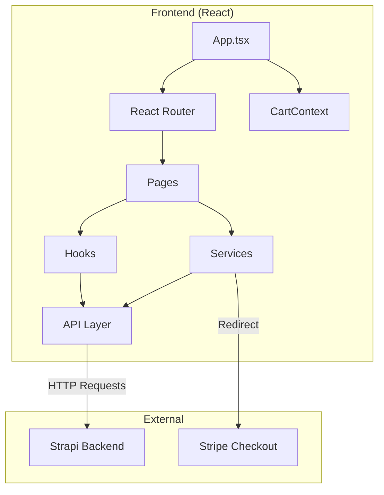

# Architecture & Tech Stack

## Architecture Overview

The frontend is a **React 18 Single Page Application (SPA)** built with **Vite** and **TypeScript**. It is designed to be **headless**, meaning it fetches all content (products, images) from the Strapi backend via REST API.

## Tech Stack

| Technology | Version | Purpose |
|------------|---------|---------|
| **React** | ^18.3.1 | Component-based UI library. |
| **Vite** | ^5.4.10 | Next-gen build tool. Fast HMR. |
| **TypeScript** | ~5.6.2 | Static typing for reliability. |
| **React Router** | ^6.28.0 | Client-side routing. |
| **Context API** | - | Built-in state management (Cart). |
| **Stripe** | - | Payment processing logic. |
