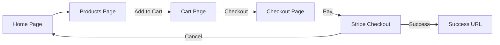
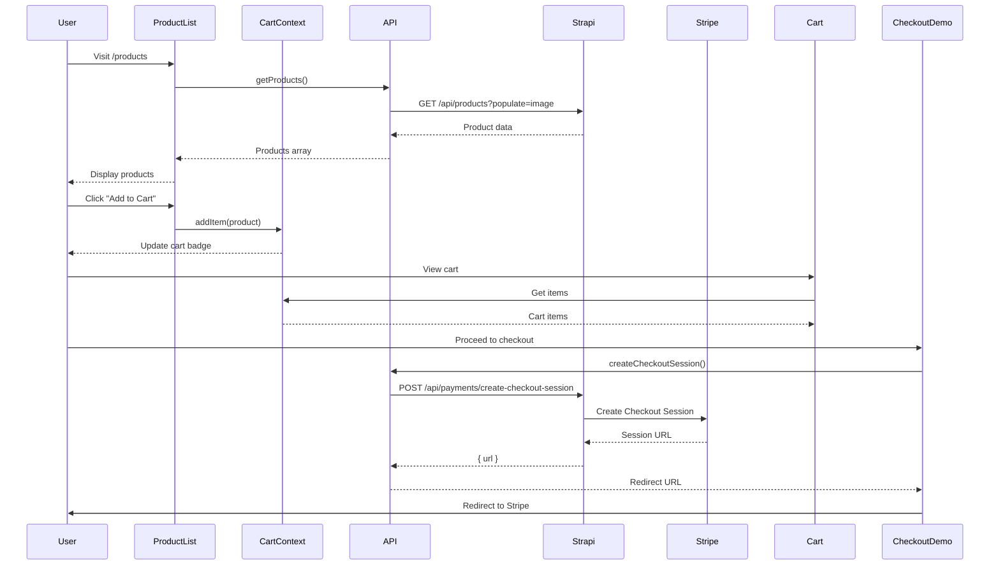

# Application Flow

## User Journey

```mermaid
flowchart LR
    Home["Home Page"] --> Products["Products Page"]
    Products -->|"Add to Cart"| Cart["Cart Page"]
    Cart -->|"Checkout"| CheckoutDemo["Checkout Page"]
    CheckoutDemo -->|"Pay"| Stripe["Stripe Checkout"]
    Stripe -->|"Success"| Success["Success URL"]
    Stripe -->|"Cancel"| Home
```

## Data Flow (Sequence Diagram)

How data moves from the User to Strapi and back.

```mermaid
sequenceDiagram
    participant User
    participant ProductList
    participant CartContext
    participant API
    participant Strapi
    participant Stripe

    User->>ProductList: Visit /products
    ProductList->>API: getProducts()
    API->>Strapi: GET /api/products?populate=image
    Strapi-->>API: Product data
    API-->>ProductList: Products array
    ProductList-->>User: Display products

    User->>ProductList: Click "Add to Cart"
    ProductList->>CartContext: addItem(product)
    CartContext-->>User: Update cart badge

    User->>Cart: View cart
    Cart->>CartContext: Get items
    CartContext-->>Cart: Cart items

    User->>CheckoutDemo: Proceed to checkout
    CheckoutDemo->>API: createCheckoutSession()
    API->>Strapi: POST /api/payments/create-checkout-session
    Strapi->>Stripe: Create Checkout Session
    Stripe-->>Strapi: Session URL
    Strapi-->>API: { url }
    API-->>CheckoutDemo: Redirect URL
    CheckoutDemo->>User: Redirect to Stripe
```
